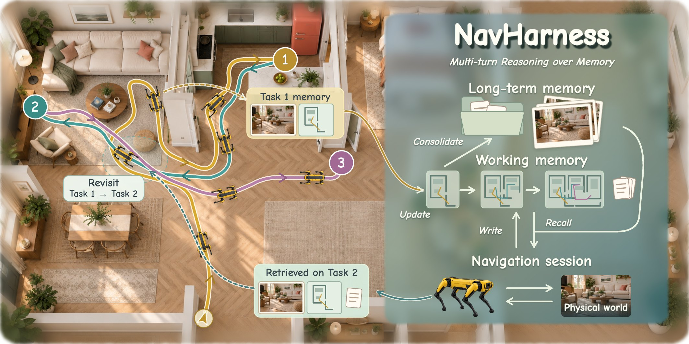
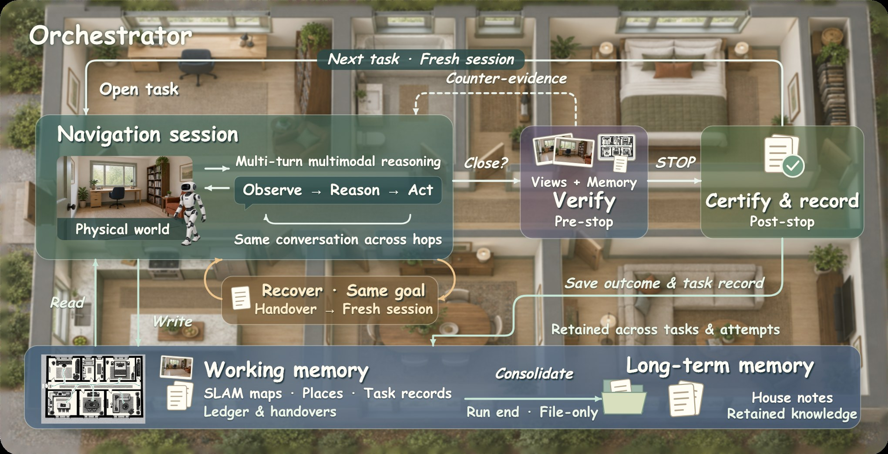
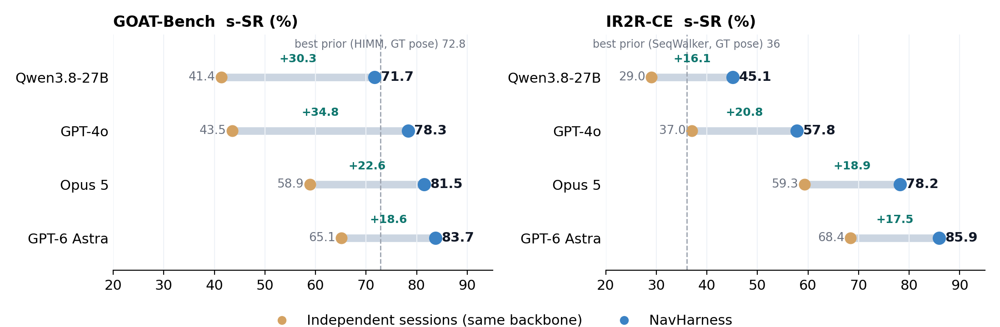
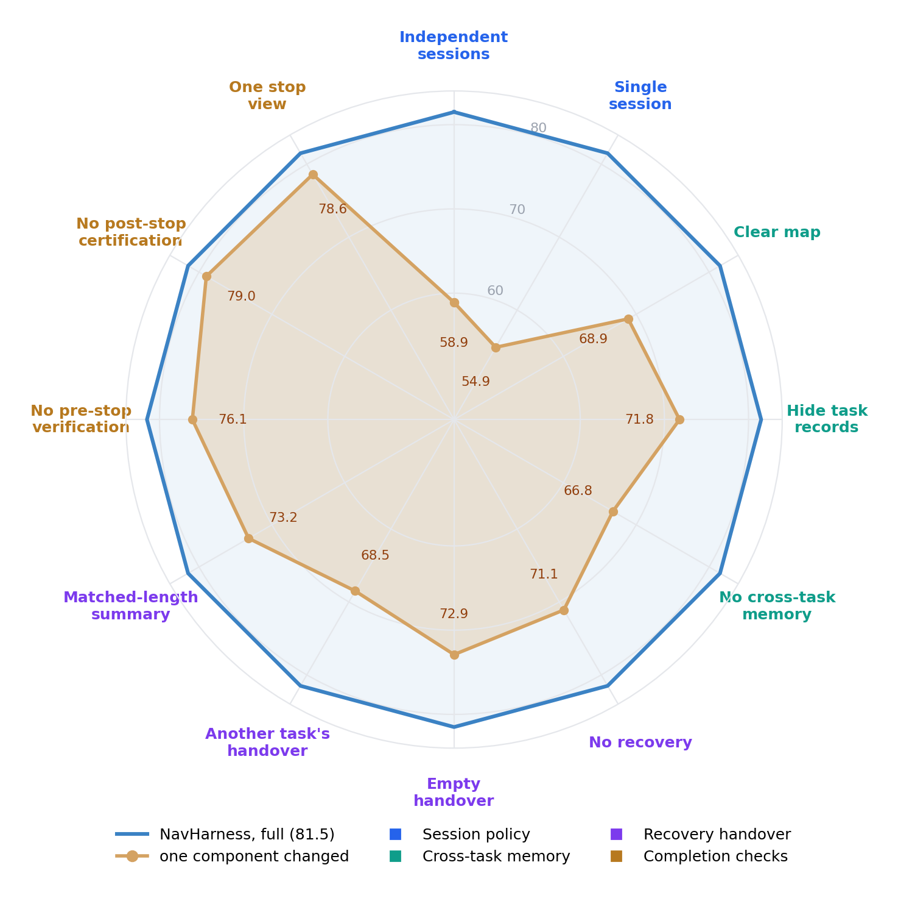
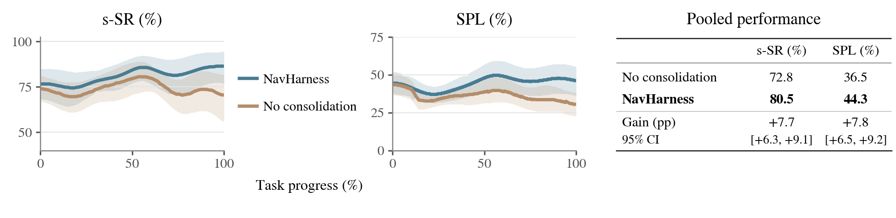

<div align="center">

<h1>NavHarness: Towards Lifelong Embodied Navigation</h1>

Xunyi Zhao<sup>1,2,*</sup>, Jian Zhou<sup>1,*</sup>, Sihao Lin<sup>1,2</sup>, Gengze Zhou<sup>1</sup>, Zerui Li<sup>1</sup>,
Xinyu Yan<sup>1,2</sup>, Jiajun Liu<sup>2,3</sup>, Anton van den Hengel<sup>1,2</sup>, Qi Wu<sup>1,2,†</sup>

<sup>1</sup>Adelaide University &nbsp; <sup>2</sup>Responsible AI Research Centre, Australian Institute for Machine Learning &nbsp; <sup>3</sup>CSIRO Data61
<br><sup>*</sup>Equal contribution &nbsp; <sup>†</sup>Corresponding author

[](https://billzhao1030.github.io/NavHarness/)
[](https://arxiv.org/abs/2609.34276)
[](#code-release)

</div>

<p align="center"></p>

<p align="center"><em>NavHarness orchestrates long-horizon embodied navigation through multi-round multimodal reasoning over working memory and house knowledge, retaining experience for successive tasks.</em></p>

> **Notice:** Please see the [paper](https://arxiv.org/abs/2609.34276) and the
> [project page](https://billzhao1030.github.io/NavHarness/) for the results.

## Overview

Frontier models can now perform well on individual embodied navigation tasks through multi-round
multimodal reasoning with simple tools. Across successive tasks, however, a robot must also rely on
an evolving map and earlier search records, both of which may be incomplete or conflict with new
observations.

**NavHarness** is a training-free embodied harness towards lifelong navigation that makes memory
processing part of the navigation loop. During navigation, a multi-round agentic session draws on
maps, task records and house knowledge, checks them against its observations, and records
corrections that guide later decisions. NavHarness preserves this experience across fresh
conversations for new tasks and recovery attempts, while outcome verification and run-end
consolidation decide what later sessions inherit.

**Highlights**

- **83.7% s-SR / 36.9% e-SR on GOAT-Bench** and **85.9% s-SR on IR2R-CE** with GPT-6 Astra, using
  SLAM-estimated poses rather than simulator ground truth.
- **+18.6 to +34.8 s-SR** over the same backbone in context-only independent sessions, across four
  reasoning models (Qwen3.8-27B, GPT-4o, Opus 5, GPT-6 Astra).
- **Structured recovery handovers outperform length-matched summaries** by 8.3 s-SR points.
- **Consolidation helps beyond retained maps and task records**: +7.7 s-SR and +7.8 SPL in continuous
  deployments across 36 houses.

## Method

<p align="center"></p>

The **orchestrator** opens sessions, advances them in bounded hops, and owns every boundary.
Memory is organised in three tiers:

| Tier | Contents | Lifetime |
|:--|:--|:--|
| **Active context** | current goal, reasoning, observations, retrieved information | one attempt |
| **Working memory** | SLAM occupancy maps, named places with photographs, room and floor connections; task records (ledger, task handovers, recovery notes, completion checks) | across tasks and attempts |
| **Long-term memory** | house notes: index, house overview, room notes, navigation skills | across runs; written only by consolidation |

A task moves through five stages:

1. **Start with retained experience.** A new goal opens a fresh conversation that is told which records to read before moving.
2. **Navigate by consulting memory.** Observation, reasoning and action interleave with map queries, file reads and marked places.
3. **Recover with a fresh conversation.** A stuck session writes a recovery note (searched vs. ruled out, untried options); a new attempt at the same goal continues from the same spot.
4. **Check completion.** A separate judge sees four stop views, earlier frames and the map. A contradicting verdict is returned to the navigator once before STOP; certification records the outcome.
5. **Consolidate.** At run end a file-only session rewrites the house notes, separating checked outcomes from claims.

## Results

All results are on the validation-unseen splits, mean over three seeds. NavHarness uses
ORB-SLAM3 poses, with no simulator pose, global navmesh or navigation-specific training.

<p align="center"></p>

### GOAT-Bench

| Method | Backbone | Pose | s-SR | SPL | e-SR |
|:--|:--|:--:|--:|--:|--:|
| SSMG-Nav | Qwen-VL-Plus | GT | 46.5 | 34.1 | 8.6 |
| AstraNav-Memory | Qwen2.5-VL-3B | GT | 62.7 | 56.9 | – |
| GSMem | GPT-4o | GT | 67.2 | 46.9 | – |
| MetaNav | GPT-4o | GT | 71.4 | 51.8 | – |
| HIMM | GPT-4o | GT | 72.8 | 56.1 | – |
| **NavHarness** | Qwen3.8-27B | SLAM | 71.7 | 48.2 | 14.4 |
| **NavHarness** | GPT-4o | SLAM | 78.3 | 57.1 | 26.9 |
| **NavHarness** | Opus 5 | SLAM | 81.5 | 55.0 | 28.6 |
| **NavHarness** | GPT-6 Astra | SLAM | **83.7** | **62.3** | **36.9** |

### IR2R-CE

| Method | Pose | s-SR | SPL | e-SR | t-nDTW |
|:--|:--:|--:|--:|--:|--:|
| MAP-CMA | GT | 35 | 32 | – | 47 |
| OVER-NAV | GT | 35 | 33 | – | 50 |
| SeqWalker | GT | 36 | 34 | – | 52 |
| **NavHarness** (Qwen3.8-27B) | SLAM | 45.1 | 32.0 | 0.0 | 43.2 |
| **NavHarness** (GPT-4o) | SLAM | 57.8 | 45.2 | 13.9 | 52.9 |
| **NavHarness** (Opus 5) | SLAM | 78.2 | 56.9 | 16.7 | 58.1 |
| **NavHarness** (GPT-6 Astra) | SLAM | **85.9** | **76.1** | **27.8** | **64.2** |

Full tables with all baselines and standard deviations are on the
[project page](https://billzhao1030.github.io/NavHarness/#results) and in the [paper](https://arxiv.org/abs/2609.34276).

### What carries navigation across tasks

<table><tr>
<td width="52%"></td>
<td>

GOAT-Bench s-SR with Opus 5 when one component is changed (full harness: 81.5).

- **A longer conversation is not memory.** One session carried across tasks (54.9) does worse
  than a fresh session per task (58.9).
- **Maps and task records both matter.** Removing both costs 14.7 points.
- **Handover content matters.** A matched-length summary trails the structured handover by
  8.3 points; another task's handover is worse than an empty one.
- **Completion checks** add 5.4 (pre-stop) and 2.5 (post-stop) points, and raise record
  accuracy from 82.6% to 90.7%.

</td></tr></table>

### Continuous deployment

Ten GOAT-Bench tours per house are chained across simulated days, with the robot restarted at
each tour's prescribed start. Across 36 houses with Opus 5, run-end consolidation raises s-SR
from 72.8 to 80.5 and SPL from 36.5 to 44.3 over a control that keeps maps and task records.

<p align="center"></p>

Replays of real deployment episodes, with the agent's messages, the notes it opened and the
judge's verdicts, are on the [project page](https://billzhao1030.github.io/NavHarness/#replays).

## Code release

The code is **coming soon**.

## TODO

- [x] Paper on [arXiv](https://arxiv.org/abs/2609.34276)
- [x] [Project page](https://billzhao1030.github.io/NavHarness/) with results and episode replays
- [ ] Source code release
- [ ] Installation guide and example configurations
- [ ] GOAT-Bench and IR2R-CE evaluation scripts
- [ ] Example deployment logs

## Citation

If you find NavHarness useful, please cite:

```bibtex
@misc{zhao2026navharness,
  title  = {NavHarness: Towards Lifelong Embodied Navigation},
  author = {Zhao, Xunyi and Zhou, Jian and Lin, Sihao and Zhou, Gengze and Li, Zerui and
            Yan, Xinyu and Liu, Jiajun and van den Hengel, Anton and Wu, Qi},
  year   = {2026},
  eprint = {2609.34276},
  archivePrefix = {arXiv},
  primaryClass  = {cs.RO}
}
```
